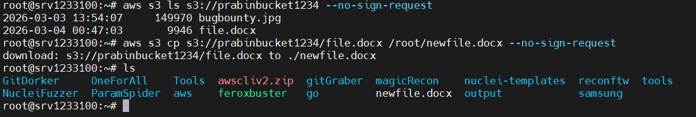

# Misconfigured AWS s3 Bucket Live Recon

- It store data
- Sometime it may leak sensitive data like
    - Credit card details
    - Password
    - Tokens
    - Codes
    - and many more
- Here, automation is also good but manual is best platform

**Automated TOOL**
- AWS CLI 
    - Lets install in Linux
    - and Now lets use it
    ```
     aws s3 ls s3://prabinbucket1234 --no-sign-request
     ```
    - How to copy content to our desktop
    


**Using tools to find leaked buckets**

- **lazys3**
        ```
        https://github.com/nahamsec/lazys3
        ```
    - Now clone the content
         ```
        git clone https://github.com/nahamsec/lazys3.git
        ```
    - go inside it
        ```
        cd lazys3
        ```
    - Run this
        ```
        ruby lazys3.rb tesla
        ```


- **S3Scanner**
    ```
    https://github.com/sa7mon/S3Scanner
    ```
    - Now type
        ```
        s3scanner -h
        ```
    - to put bucket inside s3scanner file lets search bucket in github
        ```
        aws s3 bucket wordlists github
        ```
    - lets download one raw list.txt of wordlists in terminal
        ```
        wget 
        https://raw.githubusercontent.com/koaj/aws-s3-bucket-wordlist/refs/heads/master/list.txt
        ```
    - Now start hunting
        ```
        s3scanner -bucket-file list.txt -enumerate
        ```
    - Or to get only bucket with READ
        ```
        s3scanner -bucket-file list.txt -enumerate | grep READ
        ```
    - Or to write
        ```
        s3scanner -bucket-file list.txt -enumerate | grep WRITE
        ```
    - Now whatever you will get go to google url and paste
        ```
        https://tesla.s3.amazonaws.com/
        ```
        - Example if you get marketing then
            ```
            https://marketing.s3.amazonaws.com/
            ```


**Using Website to find buckets**
- One of the popular website mostly used by bughunters
    ```
    https://buckets.grayhatwarfare.com/
    ```
- Go and search content here in search field like
    ```
    *.backup*
    ```

    ```
    username password
    ```

    ```
    netflix user
    ```
- and many more


**Next go to google hacking database**
- Search 
    ```
    aws s3
    ```
    - Now copy one of the dorks and go to google and search
        ```
        inurl:/s3.amazonaws.com ext:xml intext:index of -site:github.com
        ```


**Searching in Google**

```
https://github.com/Proviesec/google-dorks/blob/main/google-dorks-for-finding-aws-s3.txt
```