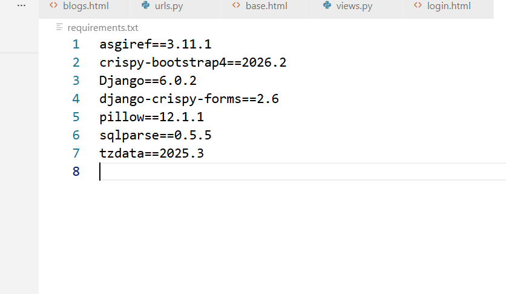
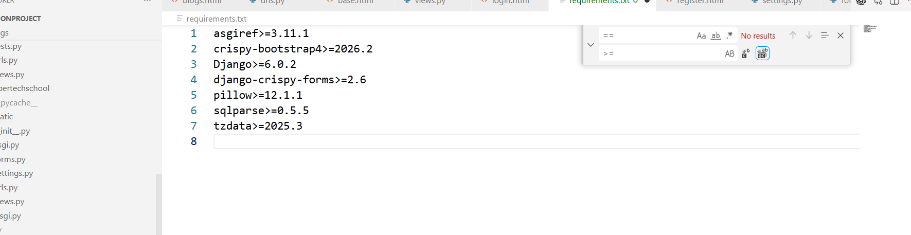
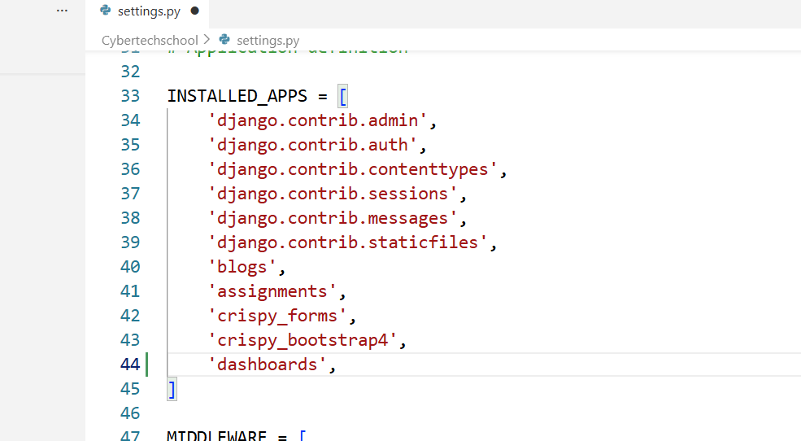
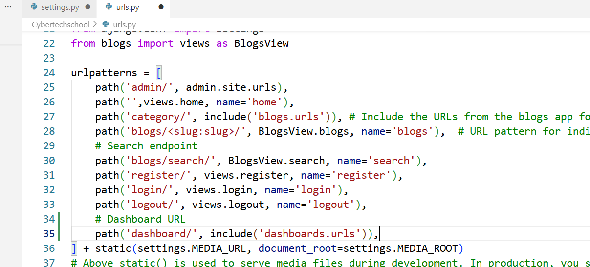
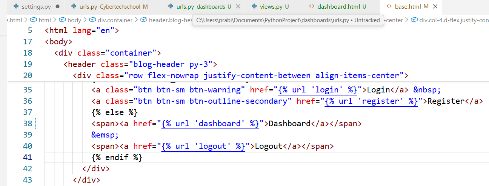

# Creating project
- **Installing Django and creating project**
    - To activate virtual environment
    ```
    source env/Scripts/activate
    ```
    ```
    pip install Django
    ```
    ```
    python -m pip install --upgrade pip
    ```
    ```
    django-admin startproject Cybertechschool .
    ```
    ```
    python manage.py runserver
    ```

- **Creating SuperUser**
    - For creating superuser our database need to have default table and for that we run migrate command
    ```
    python manage.py migrate
    ```
    - This creates default database tables
    ```
    python manage.py createsuperuser
    ```
    - This creates superuser now run server and login to super user
    ```
    python manage.py runserver
    ```
    - go to /admin and login 


- **Implementing template**
    - Now lets remove default django page and create our own home page.
    - At first, create URL pattern, for first(home) page always use empty string URL pattern
    - Go to (urls.py) and create path


- **Upgrade content to latest version in project**
    - create requirements.txt to see all library
    ```
    pip freeze > requirements.txt
    ```
    - This creates requirements.txt file

    

    - Now type 
    ```
    ctrl + h
    ```
    - to find and replace content and replace all == with >=

    

    - and run following
    ```
    pip install -r requirements.txt --upgrade
    ```

    - Now again run to bring back >= to ==
    ```
    pip freeze > requirements.txt
    ```

    


- **Creating seperate dashboard for manager and editor**
    - To create lets create seperate app
    ```
    python manage.py startapp dashboards
    ```
    - Once you create app now go to settings.py of main app and go to installed apps and write its name there
   
    

    - Now run the server
    ```
    python manage.py runserver
    ```
    - Now go to main app urls.py and lets create URL pattern for dashboard
    
    

    - Since we don't have urls.py inside dashboards so lets go and create it

    - Now lets go to views.py and create one function where there will be request to dashboard.html

    - Now go to template and create one dashboard folder and inside that folder create dashboard.html file

    - And go to base.html and include dashboard.html url

    


**Here is issue if the user is logged out also then they can use /dashboard to access it. So, now making only authorized user can access it**
- Using Decorator utility to solve this problem
    - Django has several built in decorator
        - login required
        - Required post
        - hash permission
- Go to dashboards app views.py and import it
    ```
    from django.contrib.auth.decorators import login_required
    ```

- **To create form in add_category.html**
    - In dashboards app create form.py and add all data
    - Now go to views.py in dashboards and perform activities in add_category


- **To add Comment**
    - We need to add comment in blog. So here go to blogs and go to models.py and create one class called comment
    - And go to admin.py and register comment
    ```
    admin.site.register(Comment)
    ```
    - When creating models. You need to  migrate the changes
    ```
    python manage.py makemigrations
    ```
    ```
    python manage.py migrate
    ```