# Nmap

- Nmap Live Host Discovery
- Nmap Basic Port Scans
- Nmap Advanced Port Scans
- Nmap Post Port Scans


# Nmap Live Host Discovery
- In same subnet, expect scanner to use ARP Address Resolution Protocol (ARP) queries to discover live hosts.
## ARP scan only possible in same subnet
- ARP query aims to obtain the hardware address (MAC address) so that communication at the link layer
becomes possible

- To scan list of target
    ```
    nmap -iL list_of_hosts.txt
    ```
- To check list of host nmap will scan
    ```
    nmap -sL TARGETS
    ```
- **How many IP addresses will Nmap scan if you provide the following range 10.10.0-255.101-125?** 
    ```
    nmap -sL 10.10.0-255.101-125
    ```

- **What is the first IP address Nmap would scan if you provided 10.10.12.13/29 as your target?**
    ```
    nmap -sL -n 10.10.12.13/29
    ```

## Discovering live hosts
- ARP from Link Layer
- ICMP from the Network Layer
- TCP from the Transport Layer
- UDP from the Transport Layer

### ARP
- Send frame to the broadcast address on the network segment and asking the computer with a specific IP address to respond by providing its MAC address

### ICMP
- It has many types. 
- ICMP ping uses Type 8 (Echo) and Type 0 (Echo Reply).
- To ping on the same subnet, an ARP query should precede the ICMP Echo.

### TCP & UDP
- For network scanning, a scanner can send a specially crafted packet to common TCP or UDP ports to check whether the target responds. 
- This method is efficient, especially when ICMP Echo is blocked

# Nmap host discovery using ARP
- Privileged user scan on local network(Ethernet), Nmap uses ARP request
- Privileged user on outside local network, Nmap uses ICMP echo request, TCP ACK to port 80, TCP SYN to 443 and ICMP timestamp request
- Unprovileged user on outside local network, Nmap resorts to TCP three way handshake

**NMAP bydefault uses ping scan to find live hosts**

- **Nmap to discover online hosts without port scanning live system**
    ```
    nmap -sn TARGETS
    ```

**To get MAC address, OS send ARP query**
**A host that replies to ARP queries is up**

- **to perform an ARP scan without port-scanning**
    ```
    nmap -PR -sn TARGETS
    ```
    - PR means you only want ARP scan
    ```
    nmap -PR -sn MACHINE_IP/24
    ```

## ARP scan tool
- provides many options to customise your scan
- send ARP queries to all valid IP addresses on your local networks
    ```
    arp-scan --localnet
    ```
- OR
    ```
    arp-scan -l
    ```

- Among multiple interface, you want to scan only one
    ```
    sudo arp-scan -I eth0 -l
    ```
- To scan subnet
    ```
    sudo arp-scan 10.10.210.6/24
    ```

##  we can see using tcpdump, Wireshark to see ARP Query


# Host discovery using ICMP
- Ping every IP address on a target network and see who would respond to our ping (ICMP Type 8/Echo) requests with a ping reply (ICMP Type 0)
- New windows uses host firewall to block ICMP echo bydefault
- **ARP query precedes an ICMP request if your target is on the same subnet**
- ICMP echo request to discover live hosts
    ```
    nmap -PE -sn MACHINE_IP/24
    ```
- Scanning above in same or different subnet result will be same with only one difference
    - Same subnet: result with MAC address
    - Different subnet: result without MAC address

    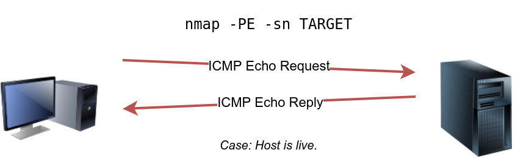

- Result in wireshark
    

- Mostly ICMP is blocked, So try ICMP timestamp request (ICMP Type 13) and with Timestamp reply (ICMP Type 14)
    ```
    nmap -PP -sn target_ip/24
    ```

    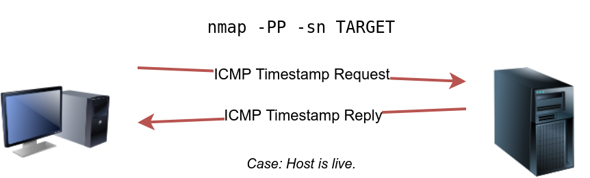

    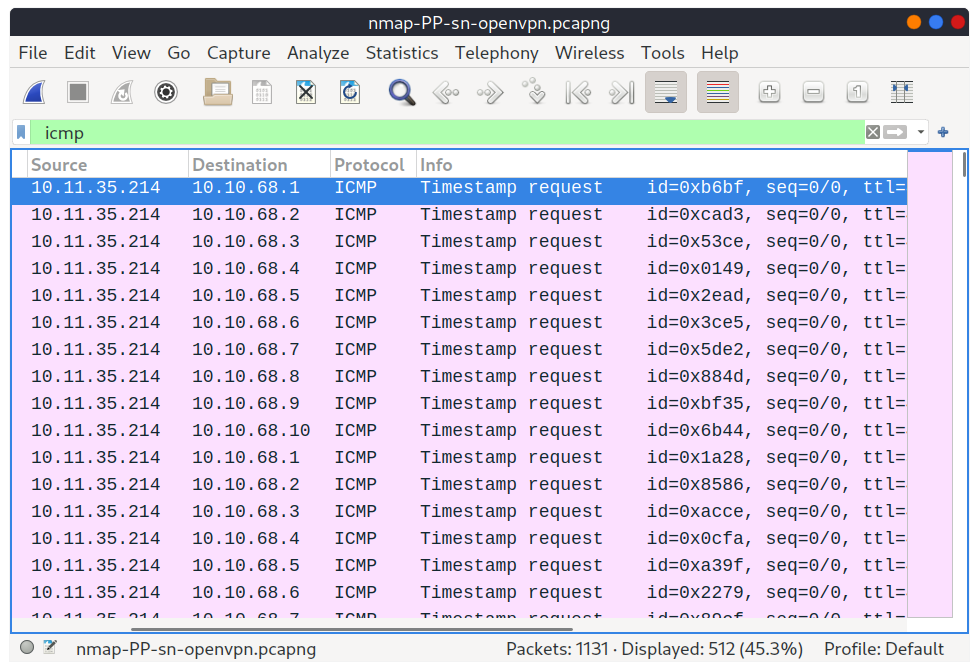

-  mask queries (ICMP Type 17) and checks whether it gets an address mask reply (ICMP Type 18)

    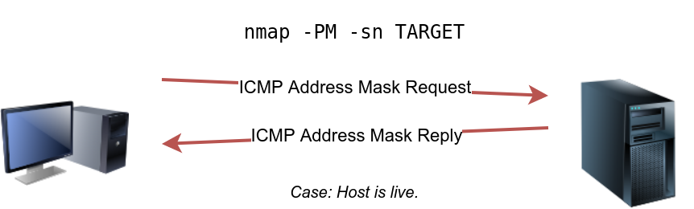

    


## Host discovery using TCP and UDP
- **TCP SYN Ping**
    - open port reply SYN/ACK (Acknowledge)
    - closed port reply RST (Reset)
        ```
        nmap -PS -sn MACHINE_IP/24
        ```
    - Privileged user: No three way TCP handshake for open port
    - Unprivileged user: Require three way TCP handshake

- **TCP ACK Ping**
    - Must be privileged user for this.
    - For unprivileged user, need attempt a 3-way handshake.
        ```
        sudo nmap -PA -sn MACHINE_IP/24
        ```
    
- **UDP ping**

    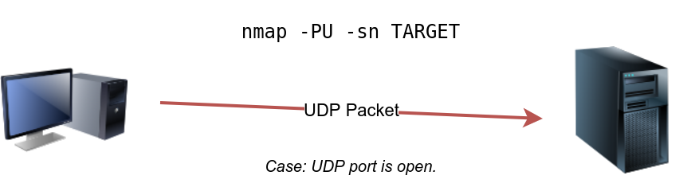

## MASSSCAN
- uses a similar approach to discover the available system
    ```
    masscan MACHINE_IP/24 -p443
    ```

    ```
    masscan MACHINE_IP/24 -p80,443
    ```

    ```
    masscan MACHINE_IP/24 -p22-25
    ```

    ```
    masscan MACHINE_IP/24 ‐‐top-ports 100
    ```

# Some important options
- no DNS lookup 
    ```
    -n
    ```
- Reverse DNS lookup for all hosts
    ```
    -R
    ```
- host discovery only
    ```
    -sn
    ```


# Nmap Basic Port Scans

## TCP flags

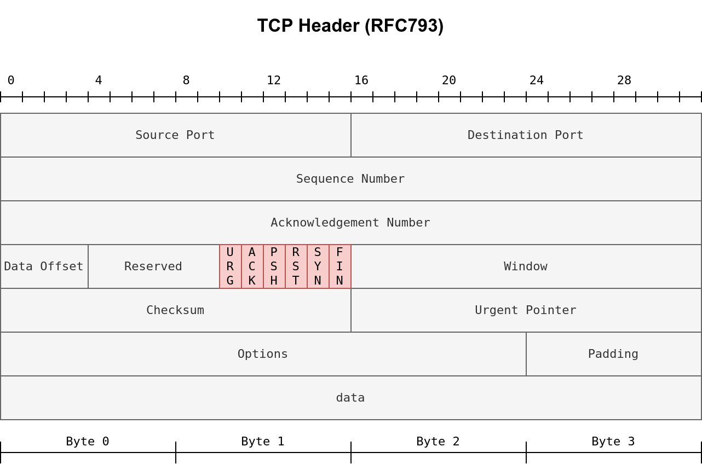

- URG 
    - Urgent pointer indicates incoming data is urgent, and processed immediately without consideration of having to wait on previously sent TCP segments
- ACK 
    - acknowledge the receipt of a TCP segment.
- PSH: 
    - Ask TCP to pass the data to the application promptly.
- RST: 
    - Used to reset the connection. 
    - firewall, might send it to tear a TCP connection. 
    - used when data is sent to a host and there is no service on the receiving end to answer.
- SYN: 
    - Used to initiate a TCP 3-way handshake and synchronize sequence numbers with the other host. 
    - Sequence number should be set randomly during TCP connection establishment.
- FIN: 
    - The sender has no more data to send.

## TCP connect Scan
- Learning whether the TCP port is open, not establishing a TCP connection. Hence the connection is torn as soon as its state is confirmed by sending a RST/ACK. You can choose to run TCP connect scan using -sT.

    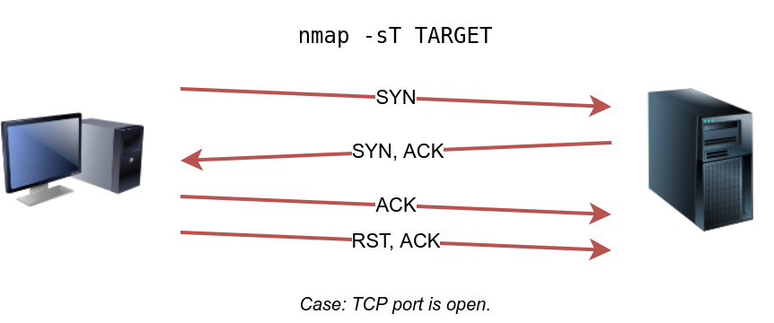

- For non-privileged user, a TCP connect scan is the only possible option to discover open TCP ports.

- TCP SYN flag set to various ports, 256, 443, 143, and so on.
- By default, Nmap will attempt to connect to the 1000 most common ports. 
- Closed TCP port responds to a SYN packet with RST/ACK to indicate that it is not open.

    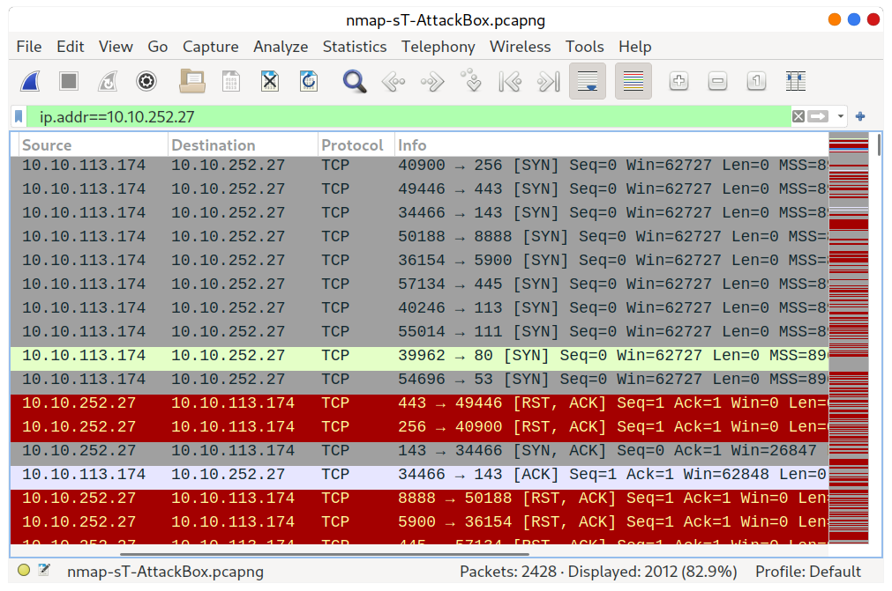

- Here, port 143 open, so it replied with a SYN/ACK, and Nmap completed the 3-way handshake by sending an ACK.
- Then, the fourth packet tears it down with an RST/ACK packet.

    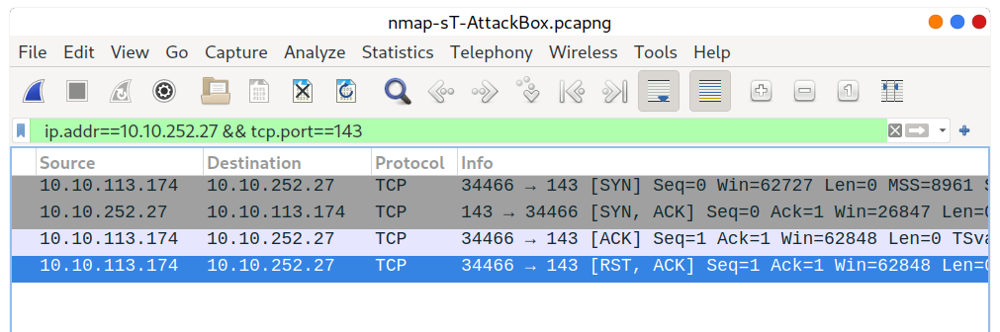


## TCP SYN SCAN
- Unprivileged users are limited to connect scan. 
- Default scan mode is SYN scan, and it requires a privileged user.
- SYN scan does not need to complete the TCP 3-way handshake; instead, it tears down the connection once it receives a response from the server

    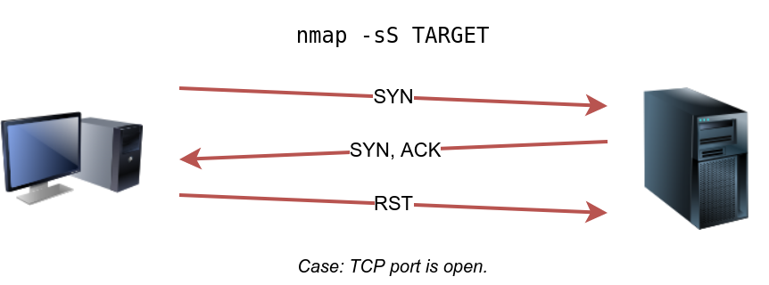

- Compare between SYN and connect
    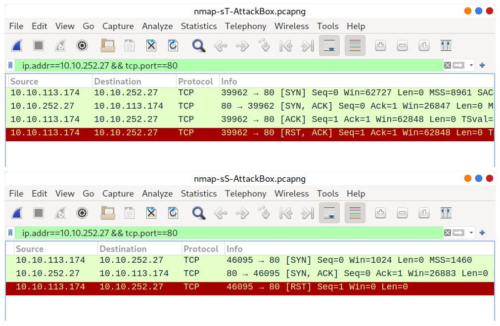

## UDP scan
- Require no handshake
- We cannot guarantee that a service listening on a UDP port would respond to our packets.
- However, if a UDP packet is sent to a closed port, an ICMP port unreachable error (type 3, code 3) is returned

    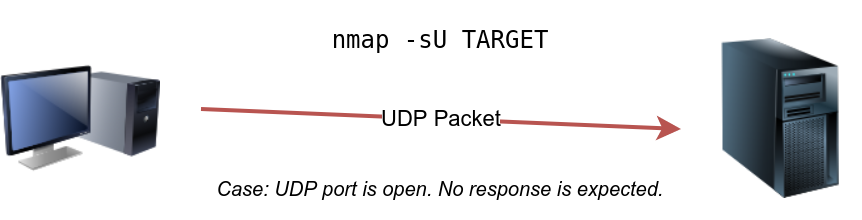

    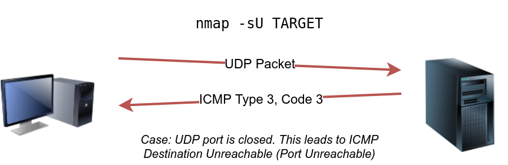

## Fine tuning scope
- Port list
    ```
    -p22,80,443
    ```
- Port range
    ```
    -p1-1023
    ```
- Scan all ports
    ```
    -p-
    ```
- To control scan time
    ```
    -T<0-5>
    ```
    - paranoid (0)
    - sneaky (1)
    - polite (2)
    - normal (3)
    - aggressive (4)
    - insane (5)
        - T0 is slowest
        - T5 is fastest
        - To avoid IDS alert use T0 or T1
        - T0 scans one port at a time and waits 5 minutes between sending each probe, so you can guess how long scanning one target would take to finish
        - Normal T3
        - T5 most aggressive and effect accuracy due to data lost
        - T4 used during practice and in CTF
        - -T1 is often used during real engagements where stealth is more important
    - Control packet using
        ```
        --max-rate 10
        ```
        ```
        --max-rate=10
        ```
    - control probing parallelization
        ```
        --min-parallelism <numprobes>
        ```
        ```
        --max-parallelism <numprobes>
        ```

- Scan most common 100 ports
    ```
    -F
    ```
    

# NMAP advance port scan

## TCP NULL scan
- Does not set any flag
- All six flag bits are set to zero
    ```
    nmap -sN target
    ```
    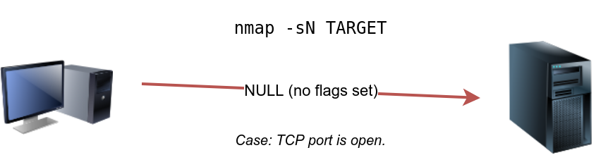

    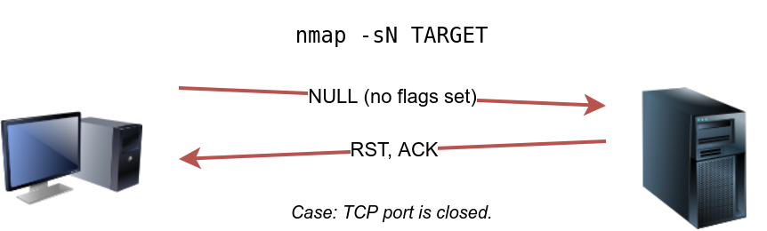

## FIN scan
-  Sends a TCP packet with the FIN flag set
    ```
    nmap -sF target
    ```
    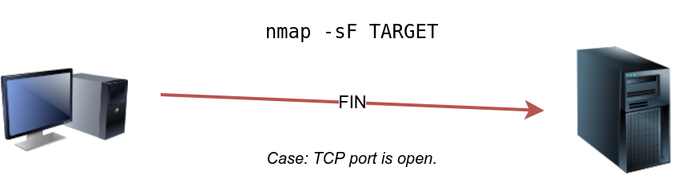

    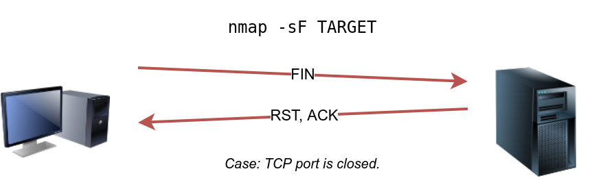
- Some firewalls will 'silently' drop the traffic without sending an RST.

## XMAS scan
-  Sets the FIN, PSH, and URG flags
    ```
    nmap -sX target
    ```
- Like the Null scan and FIN scan, if an RST packet is received, it means that the port is closed.
- Otherwise, it will be reported as open|filtered
- Three scan types is efficient when scanning a target behind a stateless .
- Stateless will check if the incoming packet has the SYN flag set to detect a connection attempt.
- Using a flag combination that does not match the SYN packet makes it possible to deceive the and reach the system behind it.
- However, a stateful will practically block all such crafted packets and render this kind of scan useless.

## Maimon Scan
- FIN and ACK bits are set
- target send an RST packet as a response
- scan won’t work on most targets encountered in modern networks
    ```
    nmap -sM target
    ```

    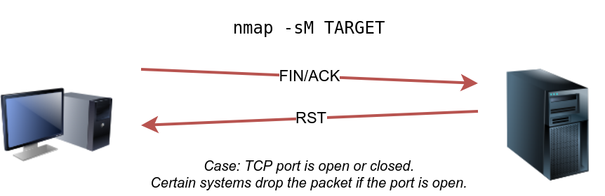

## TCP ACK scan
- ACK flag is set
    ```
    nmap -sA target
    ```
    
    

- Here, identifying open port is difficult
- Useful when there is firewall to learn which port are not blocked by firewall
- Try to perfrom this attack repeatedly

## Window Scan
- Similar to ACK scan

    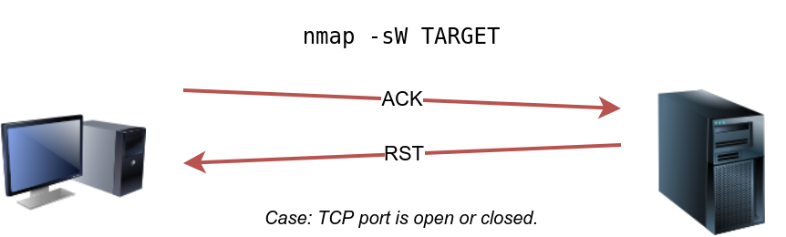

- if we repeat scan against a server behind a firewall , we expect to get more satisfying results

## Custom Scan
- Used to combine TCP flags
    ```
    nmap --scanflags RSTSYNFIN target
    ```
    - This set SYN, RST, and FIN simultaneously

- **Remember that firewall is not blocking a specific port,does not mean that a service is listening on that port.There is possibility firewall rules need to be updated to reflect recent service changes. Hence, ACK and window scans are exposing the firewall rules, not the services.**

## Spoofing and Decoys
- Some network setup allows scan target using spoofed IP and even spoofed MAC
- Scanning random network with spoof IP, high chances no response

    

- generally,specify network interface using -e and disable ping scan -Pn. 
- Instead of 
    ```
    nmap -S SPOOFED_IP MACHINE_IP
    ```
    - use 
    ```
    nmap -e NET_INTERFACE -Pn -S SPOOFED_IP MACHINE_IP
    ```
    -  to tell explicitly which network interface to use and not to expect to receive a ping reply
    - It is worth repeating that this scan will be useless if the attacker system cannot monitor the network for responses.

- In same subnet, you can spoof MAC uing
    ```
    --spoof-mac SPOOFED_MAC
    ```
- Spoofing works only in some cases, 
    - So, attacker might resort to using decoys to make it more challenging to be pinpointed by making scan appear to be coming from many IP addresses.So,attacker’s IP address would be lost among them

    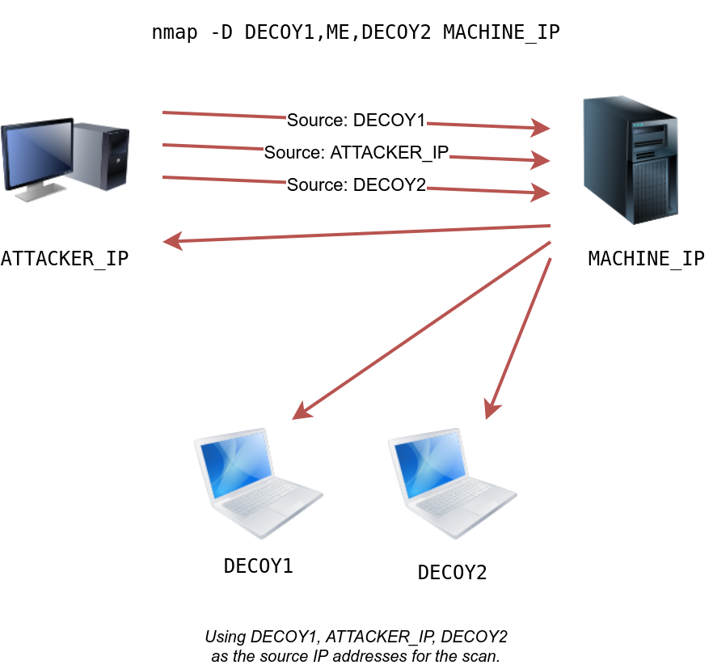

    ```
    nmap -D 10.10.0.1,10.10.0.2,attacker_ip
    ```
    OR
    ```
    nmap -D 10.10.0.1,10.10.0.2,RND,RND,attacker_ip
    ```
    - Where RND will automatically takes random IP


## Fragmented Packets
- Firewall
    -  Piece of software or hardware that permits packets to pass through or blocks them based on firewall rule
    - Traditional firewall inspects, the IP header and the transport layer header.
    - More sophisticated firewall would also try to examine the data carried by the transport layer.

- IDS
    -  Inspects network packets for select behavioural patterns or specific content signatures and raise alert for malicious rule
    - Along with IP header and transport layer header,It inspects the data contents in the transport layer and check if it matches any malicious patterns

**How can you prevent NMAP activity to detect from Firewall/IDS?**
- It is not so easy to do this but you can benefit by dividing packet into smaller packet

**How to fragment it?**
- Using 
    ```
    -f
    ```
    - Divides into 8 bytes or less
- Using
    ```
    -f -f
    ```
    Or
    ```
    -ff
    ```
    - Divides into 16 byte instead of 8 byte

- You can change default value by
    ```
    --mtu
    ```
    - But always should be in multiple of 8
- Without fragment
    ```
    sudo nmap -sS -p80 10.20.30.144
    ```
    
- with fragment
    ```
    sudo nmap -sS -p80 -f 10.20.30.144
    ```

## Idle/Zombie Scan
- Spoofing source IP can be great approach to stealth scan but will work in specific network because monitor network traffic is required
- So, give it an upgrade with the idle scan
- It requires an idle system(like printer) connected to the network that you can communicate with

    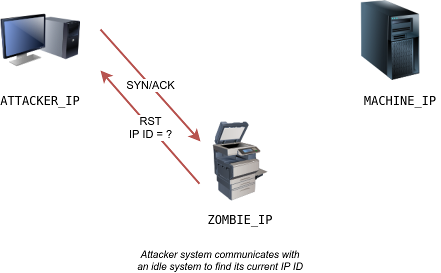

- Nmap make each probe coming from idle host and check whether idle host received any response
    ```
    nmap -sI ZOMBIE_IP MACHINE_IP
    ```
    - Where ZOMBIE_IP is ip of idle machine(like printer)

- Three scenario
    - For closed port

        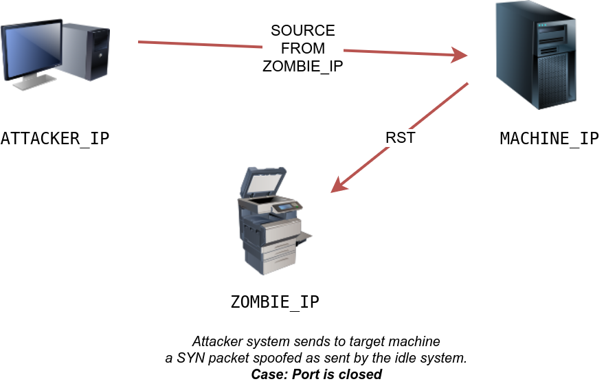
    
    - For open port

        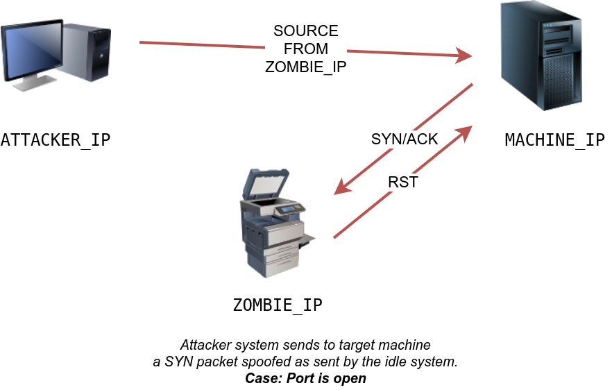

    - For firewall
        -  target machine does not respond due to firewall rules and same result as with the closed port

## More details during scan
- More details regarding its reasoning and conclusions
    ```
    sudo nmap -sS --reason Ipaddress
    ```
- Debuggine
    ```
    -d
    ```
- More details for debugging
    ```
    -dd
    ```

- For OS detection
    ```
    sudo nmap -sS -O MACHINE_IP
    ```
- For traceroute detection
    ```
    sudo nmap -sS --traceroute MACHINE_IP
    ```
- Saving output
    - The three main formats are:
        - Normal
        - Grepable (grepable)
        - XML
