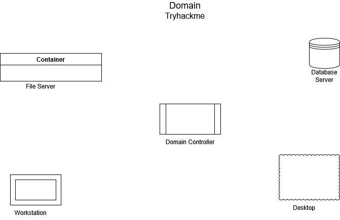

# Active Directory Basics
- Microsoft active directory is the backbone of the corporate world

- **Windows Domain**
    - Small network: 
        - you can manage manually when you have 5 to 10 users
    - Large network:
        - Not possible to manage manually. So, window domain is used. It is group of users and computers under the administration of given business
    - The main idea is to centralise the administration of common components of computer network in a single repository called Active Directory(AD)
    - The server that runs in AD services is called Domain Controller(DC)

    