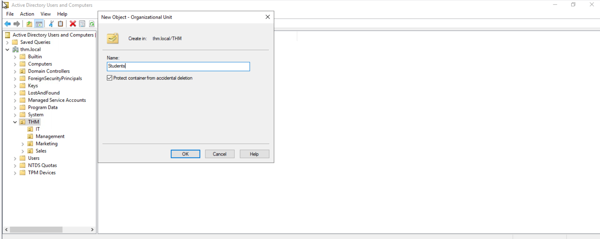
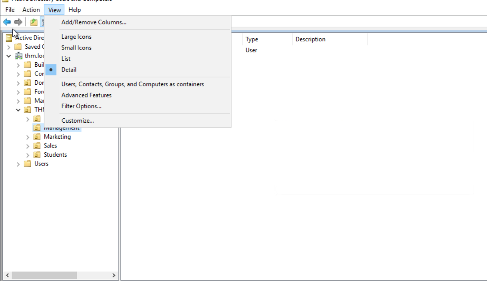
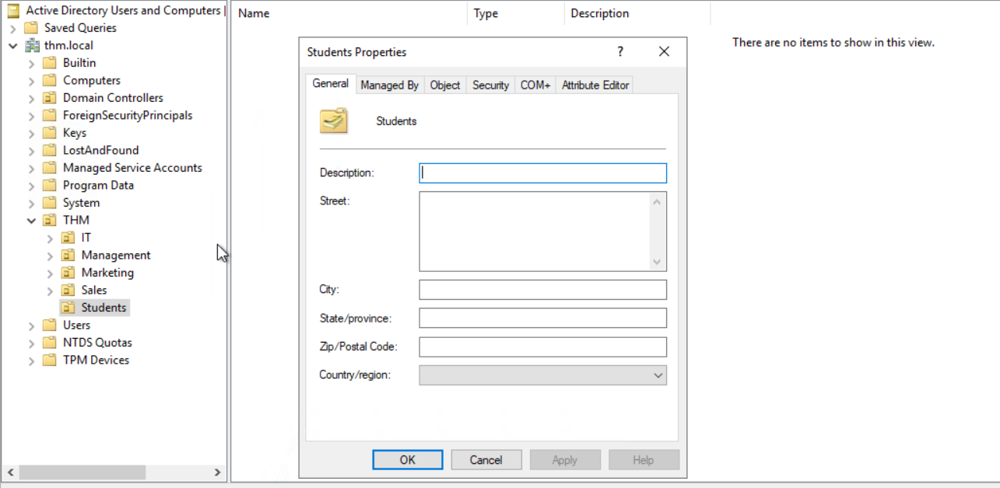
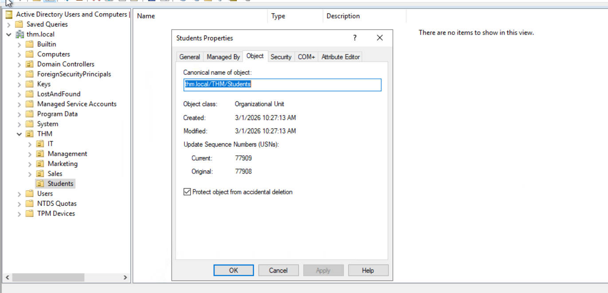
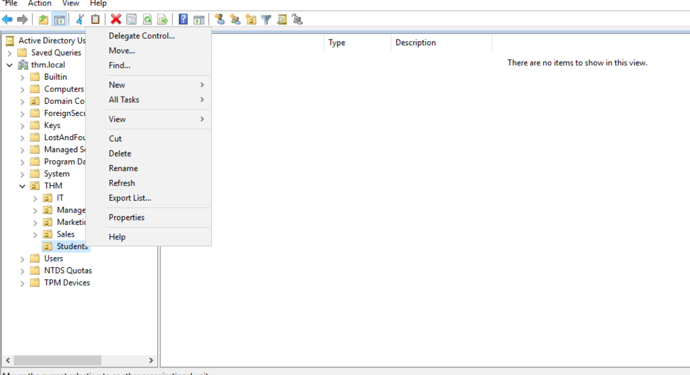

# Active Directory Basics
- Microsoft active directory is the backbone of the corporate world

- **Windows Domain**
    - Small network: 
        - you can manage manually when you have 5 to 10 users
    - Large network:
        - Not possible to manage manually. So, window domain is used. It is group of users and computers under the administration of given business
    - The main idea is to centralise the administration of common components of computer network in a single repository called Active Directory(AD)
    - The server that runs in AD services is called Domain Controller(DC)

    

- **Active Directory**
    - Core of any windows domain is Active Directory Domain Service(ADDS)
    - Acts as catalouge to hold information of all objects that exist on network
    - Objects supported are
        - Users
        - Groups
        - Machines
        - Printers
        - Shares
    
- **Users**
    - Most common object type
    - known as security principals, authenticated by domain and assigned privileges over resources

- **Active directory Users and Computer**
    - Run active directory users and computer from start menu
    - Objects are organized in Organizational Units(OUs)

- Machine account name is computer name followed by dollar sign
    - Machine name: DC01
    - Machine account name: DC01$

- **Managing users in AD**
    - First task as new domain administrator is to check existing OUs and users as some recent changes has happened
    
    

- **Deleting extra OUs and Users**
    - To delete OUs, we need to enable advanced features in view menu
    - After enabling it right click the OU and go to properties - Object

    
    
    
    - Trying to delete OU it is saying permission is not allowed
    
    - Now go to view and enable advanced features 
    
    - After enabling advanced features go to one OU(e.g student) and click right and go to properties
    
    - Go to object and untick protect data from accidential deletion
    
    

